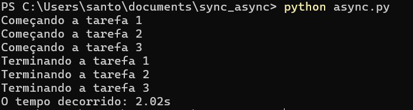
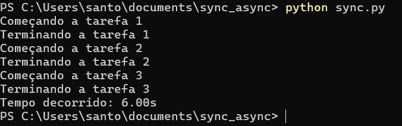

# Asynchronous vs Synchronous Task Execution in Python

This repository compares asynchronous and synchronous task execution in Python, showcasing performance differences between `asyncio` and `time.sleep`.

## Comparison

### Asynchronous Programming (asyncio):

- Allows concurrent execution of tasks.
- Total execution time is close to that of a single task (around 2 seconds).

### Synchronous Programming (time.sleep):

- Executes tasks sequentially, blocking program execution.
- Total execution time is the sum of all tasks (around 6 seconds).

## Async running

## Sync running

